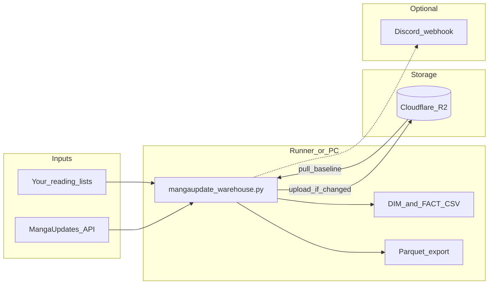

# MangaUpdate

A small **personal data warehouse** for [Baka-Manga Updates](https://www.mangaupdates.com/) reading lists: it syncs your lists through the official API, keeps a **dimension** table of series metadata, appends **facts** when chapter counts advance, exports **Parquet**, and mirrors everything to **Cloudflare R2**—with optional **Discord** alerts and a **GitHub Actions** schedule so the runner never overwrites R2 without a successful baseline download.

[](https://github.com/Fayiette/MangaUpdate/actions/workflows/mangaupdate-fetch.yml)

---

## What it does


| Layer                             | Role                                                                                                   |
| --------------------------------- | ------------------------------------------------------------------------------------------------------ |
| **DIM** (`DIM_`* CSV / Parquet)   | One row per series: title, max chapter, genres, authors, cover URLs, etc.                              |
| **FACT** (`FACT_`* CSV / Parquet) | Append-only chapter-progress events with a UTC date stamp when your list chapter moves forward.        |
| **R2**                            | Canonical storage for CSV + Parquet; each job pulls first, then merges, then uploads if files changed. |


On **GitHub Actions**, every run starts from an empty checkout: the workflow injects secrets, the script downloads the current CSVs from R2, updates them, and uploads again—so the filenames you configure are simply **where those files live for that run** on the runner (the same variable names are used in a local `.env` when you run the script yourself).

---

## Architecture (high level)




---

## Features

- **Authenticated** MangaUpdates API access (lists → series progress, series metadata for enrichment).
- **Rate limiting** between requests (polite use of the API).
- **Strict R2 pull in CI** (`GITHUB_ACTIONS` / `CI`): the job fails instead of uploading a truncated dataset if baseline CSVs did not download—except the intentional “both objects missing” empty-bucket bootstrap.
- **Optional R2 object key overrides** when bucket object names differ from your workspace filenames (`R2_`* env vars).
- **Hash-based change detection** so Parquet export and R2 upload only happen when something actually changed.
- **CLI** for `--dump-sample`, `--full-image-refresh`, and `--require-r2-pull`.

---

## Requirements

- **Python 3.12+** (matches the workflow; slightly older may work if dependencies install.)
- Dependencies are listed in `[requirements.txt](requirements.txt)`: `requests`, `boto3`, `pandas`, `pyarrow`, `python-dotenv`.
- Accounts / services: **MangaUpdates** login, **R2** (S3-compatible endpoint), optional **Discord** webhook.

---

## Local usage

1. Clone the repository.
2. Copy `[.env.example](.env.example)` to `.env` and fill **every required key** (the script exits immediately if any are missing).
3. Install and run:

```bash
pip install -r requirements.txt
python mangaupdate_warehouse.py
```

Optional flags:

```text
python mangaupdate_warehouse.py --dump-sample [SERIES_BASE36]
python mangaupdate_warehouse.py --full-image-refresh
python mangaupdate_warehouse.py --require-r2-pull
```

---

## GitHub Actions

The workflow `[.github/workflows/mangaupdate-fetch.yml](.github/workflows/mangaupdate-fetch.yml)` uses:

- `**environment: prod**` — configure **Environment secrets** on `prod` with the **exact** names referenced in the workflow (API URL, paths, R2, MangaUpdates credentials, Discord, optional `R2_*` and `SERIES_API_SAMPLE_PATH`).
- **Scheduled cron** triggers plus `**workflow_dispatch`** for manual runs.

If a required secret is missing or empty, the Python entrypoint exits with a non-zero status and sends a Discord alert when a webhook is configured.

---

## Environment variables

Authoritative documentation lives in `[.env.example](.env.example)`. Required keys include `MANGAUPDATES_API_BASE_URL`, the four `*_PATH` values for CSV/Parquet workspace filenames, and `MANGAUPDATES_USERNAME` / `MANGAUPDATES_PASSWORD` (checked in `main()`).

---

## Third-party services and responsibility

This project talks to **MangaUpdates** and stores **your own** list data. You are responsible for complying with the [MangaUpdates API / site terms](https://www.mangaupdates.com/) and for any data you store in R2 or elsewhere. This software is provided as-is; it is not affiliated with MangaUpdates.

---

## License and credit

This repository is licensed under the **GNU Affero General Public License v3.0** (`[LICENSE](LICENSE)`).

- **Sharing is allowed** (redistribution of the program).
- **Credit / attribution is mandatory**: license section 4 requires retaining copyright notices and appropriate notices on interactive use.

---

## Contributing and forks

Pull requests are disabled but forks are welcome under the terms of the license. Please preserve copyright and license notices in any distribution.
